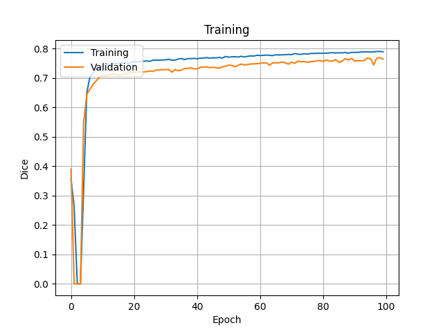

# Nuclei-Segmentation
Nucleus segmentation in histopathological images using deep learning methods.

## Overview
This project focuses on segmenting nuclei in histopathological images using deep learning techniques. It implements and evaluates **U-Net, ResUNet, and LinkNet-34** models on the **MoNuSeg dataset** and compare their  performance.

## Dataset
The [**MoNuSeg dataset**](https://monuseg.grand-challenge.org/Data) is used for training and evaluation. It consists of histopathological images with nuclei masks.
## Methodology

### Loss Function
The **Multi-Loss** approach is used for training, which combines multiple loss functions by summing them:
- **Binary Cross Entropy (BCE) Loss**
- **Focal Loss**
- **Dice Loss**  

### Data Preprocessing & Augmentation
To improve model generalization, the following preprocessing and augmentation techniques are applied:
- **Macenko Normalization** to standardize stain variations in histopathological images.
- **Random rotations and flips** to increase dataset variability.

## Results
### Training Progress
Below are the training charts showing the progress of different metrics over epochs for the U-Net model.

| Loss | Accuracy |
|------------|---------------|
|  |  |

| Dice Coefficient | IoU |
|------------------------|-----------|
|  |  |

### Model Performance on Test Set
Below is a table comparing the results of different models on the test dataset. Metrics include **Loss, Dice Coefficient, Accuracy, and IoU**.

| Model      | Loss  | Dice Coef | Accuracy | IoU  |
|------------|-------|----------|----------|------|
| U-Net      | 0.4915  | 0.7923     | 0.8890     | 0.6572 |
| ResUNet    | 0.4455  | 0.8089     | 0.8987     | 0.6809 |
| LinkNet-34 | 0.4387  | 0.8045     | 0.9015     | 0.6742 |

### Example Segmentation Results of U-Net Model
|  |  |  |
|----------------------------------------|-------------------------------------|-------------------------------------|
| **Input Image** | **Ground Truth (Mask)** | **Prediction (U-Net)** |
